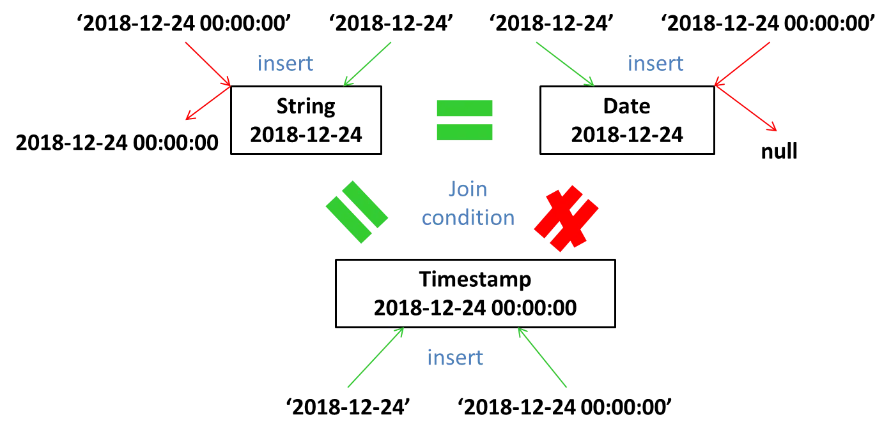

<!-- TOC  -->
- [1. 数值类型（Numeric Types）](#1-数值类型numeric-types)
    - [1.1 `TINYINT`](#11-tinyint)
    - [1.2 `SMALLINT`](#12-smallint)
    - [1.3 **`INT/INTEGER`**](#13-intinteger)
    - [1.4 **BIGINT**](#14-bigint)
    - [1.5 `FLOAT`](#15-float)
    - [1.6 `DOUBLE/DOUBLE PRECISION`](#16-doubledouble-precision)
    - [1.7 **`DECIMAL/NUMERIC`**](#17-decimalnumeric)
- [2. 日期时间类型（Date/Time Types）](#2-日期时间类型datetime-types)
    - [2.1 **`TIMESTAMP`**](#21-timestamp)
    - [2.2 **`DATE`**](#22-date)
    - [2.3 `INTERVAL`](#23-interval)
- [3. 字符串类型（String Types）](#3-字符串类型string-types)
    - [3.1 **`STRING`**](#31-string)
    - [3.2 `VARCHAR`](#32-varchar)
    - [3.3 `CHAR`](#33-char)
- [4. 杂项类型（Misc Types）](#4-杂项类型misc-types)
    - [4.1 `BOOLEAN`](#41-boolean)
    - [4.2 `BINARY`](#42-binary)
- [5.复杂类型（Complex Types）](#5复杂类型complex-types)
    - [5.1 `ARRAY`](#51-array)
    - [5.2 `MAP`](#52-map)
    - [5.3 `STRUCT`](#53-struct)
    - [5.4 `UNIONTYPE`](#54-uniontype)
- [6. 隐式转换(Implicit Conversions)](#6-隐式转换implicit-conversions)
<!-- /TOC -->
# 1. 数值类型（Numeric Types）
## 1.1 `TINYINT`
- 1 字节有符号整数，从`-128`到`127`。 
## 1.2 `SMALLINT`
- 2 字节有符号整数，从`-32,768`到`32,767`。 
## 1.3 **`INT/INTEGER`**
- 4 字节有符号整数，从`-2,147,483,648`到`2,147,483,647`。 
- 在2.20版本中，引入`INTEGER`作为`INT`的同义词。 
- 整数默认为`INT`,除非超过了`INT`的最大值，才会转为`BIGINT`，或者带有以下后缀。 
    - `Y`：`TINYINT` 
    - `S`：`SMALLINT` 
    - `L`：`BIGINT` 
## 1.4 **BIGINT**
- 8 字节有符号整数，从`-9,223,372,036,854,775,808`到`9,223,372,036,854,775,807`。 
## 1.5 `FLOAT`
- 4 字节单精度浮点数。 
## 1.6 `DOUBLE/DOUBLE PRECISION`
- 8 字节双精度浮点数。 
- `DOUBLE PRECISION` 是 `DOUBLE` 的别名，自2.2.0版本开始使用。 
## 1.7 **`DECIMAL/NUMERIC`**
- 0.11.0版本中引入，精度为 38 位。 
- 0.13.0版本引入了用户可定义的精度。 
- `NUMERIC`与`DECIMAL`是相同，自3.0.0版本开始使用。 
- 使用`DECIMAL(precision, scale) `定义，`precision`表示总位数，`scale`表示小数位数。如果未指定precision，则默认为10。如果未指定scale，它将默认为0（无小数位）。 
- 如果超出总位数会为`NULL`，如果超出精度会四舍五入。 
# 2. 日期时间类型（Date/Time Types）
## 2.1 **`TIMESTAMP`**
- 从0.8.0版本开始使用。 
-  
## 2.2 **`DATE`**
- 从0.12.0版本开始使用。 
## 2.3 `INTERVAL`
- 从1.2.0版本开始使用。 
# 3. 字符串类型（String Types）
## 3.1 **`STRING`**
- 以用单引号(')或双引号(")表示。 
## 3.2 `VARCHAR`
- 从0.12.0版本开始使用。 
- 最大长度65535，如果要转换/分配给`varchar`的字符串值超出了长度说明符，则该字符串将被静默截断。 
## 3.3 `CHAR`
- 从0.13.0版本开始使用。 
- 最大长度255，类似于`VARCHAR`，但它们是固定长度的，这意味着比指定长度值短的值用空格填充。 
# 4. 杂项类型（Misc Types）
## 4.1 `BOOLEAN`
## 4.2 `BINARY`
- 从0.8.0版本开始使用。 
# 5.复杂类型（Complex Types）
## 5.1 `ARRAY`
- `array<data_type>`，例如：`array<int>`。 
- 从0.14版本开始，允许使用负值和非常数表达式。 
## 5.2 `MAP`
- `map<key_type, value_type>`，例如：`map<string, int>`。 
- 从0.14版本开始，允许使用负值和非常数表达式。 
## 5.3 `STRUCT`
- `struct<col_name : data_type [comment col_comment], ...>`，例如：`struct<value: string>`。 
## 5.4 `UNIONTYPE`
- 从0.7.0版本开始使用。 
- `uniontype<data_type, data_type, ...>`，例如：`uniontype<int, string>`。 
# 6. 隐式转换(Implicit Conversions)
|            |void |boolean|tinyint|smallint| int |bigint|float|double|decimal|string|varchar|timestamp|date |binary|
|:----------:|:---:|:-----:|:-----:|:------:|:---:|:----:|:---:|:----:|:-----:|:----:|:-----:|:-------:|:---:|:----:|
|  void to   |  1  |   1   |   1   |    1   |  1  |   1  |  1  |   1  |   1   |  1   |   1   |    1    |  1  |   1  |
| boolean to |  0  |   1   |   0   |    0   |  0  |   0  |  0  |   0  |   0   |  0   |   0   |    0    |  0  |   0  |
| tinyint to |  0  |   0   |   1   |    1   |  1  |   1  |  1  |   1  |   1   |  1   |   1   |    0    |  0  |   0  |
|smallint to |  0  |   0   |   0   |    1   |  1  |   1  |  1  |   1  |   1   |  1   |   1   |    0    |  0  |   0  |
|   int to   |  0  |   0   |   0   |    0   |  1  |   1  |  1  |   1  |   1   |  1   |   1   |    0    |  0  |   0  |
| bigint to  |  0  |   0   |   0   |    0   |  0  |   1  |  1  |   1  |   1   |  1   |   1   |    0    |  0  |   0  |
|  float to  |  0  |   0   |   0   |    0   |  0  |   0  |  1  |   1  |   1   |  1   |   1   |    0    |  0  |   0  |
|  double to |  0  |   0   |   0   |    0   |  0  |   0  |  0  |   1  |   1   |  1   |   1   |    0    |  0  |   0  |
| decimal to |  0  |   0   |   0   |    0   |  0  |   0  |  0  |   0  |   1   |  1   |   1   |    0    |  0  |   0  |
| string to  |  0  |   0   |   0   |    0   |  0  |   0  |  0  |   1  |   1   |  1   |   1   |    0    |  0  |   0  |
| varchar to |  0  |   0   |   0   |    0   |  0  |   0  |  0  |   1  |   1   |  1   |   1   |    0    |  0  |   0  |
|timestamp to|  0  |   0   |   0   |    0   |  0  |   0  |  0  |   0  |   0   |  1   |   1   |    1    |  0  |   0  |
|  date to   |  0  |   0   |   0   |    0   |  0  |   0  |  0  |   0  |   0   |  1   |   1   |    0    |  1  |   0  |
|  binary to |  0  |   0   |   0   |    0   |  0  |   0  |  0  |   0  |   0   |  0   |   0   |    0    |  0  |   1  |